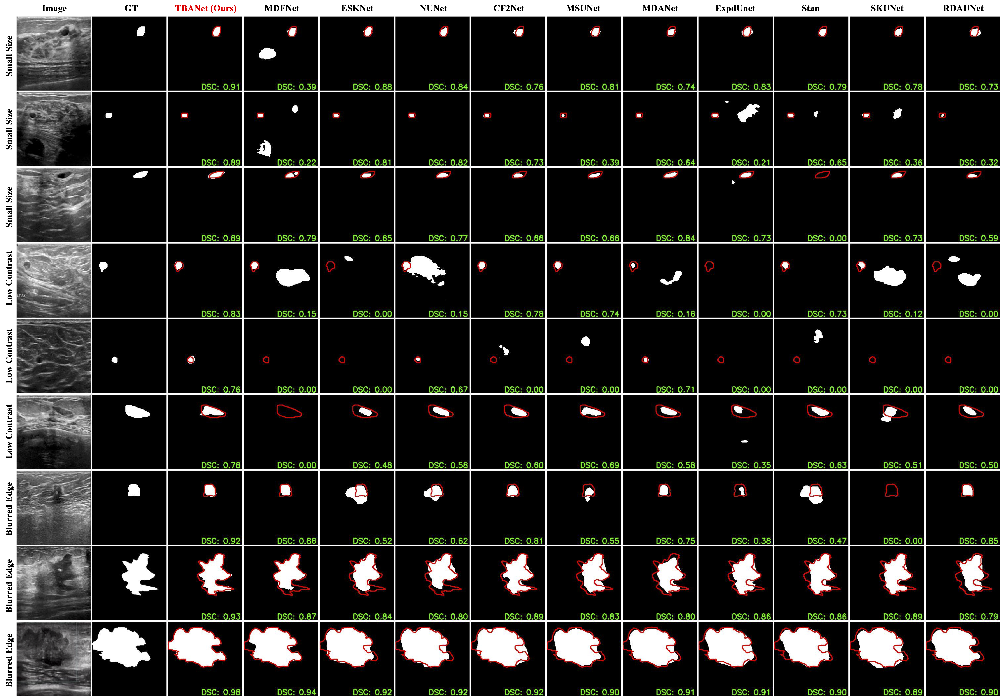

# TBANet


This repository includes Pytorch implementation for the following paper:

**Tumor Segmentation and Boundary Fusion Network via Hierarchical Cross-Correlation Learning, 2025.**<br/>
<a href="https://github.com/gqding" target="_blank">Guanqun Ding</a>, <a href="" target="_blank">Kaiwen Yang</a>, <a href="" target="_blank">Leyuan Sun</a>, <a href="" target="_blank">Yuming Fang*</a>
([Paper]())

The code repository is under construction and will be released soon.

## Getting Started
### 1. Installation
You can install the envs from yml file by
```
conda env create -f environment.yml
```

### 2. Datasets

The download links of datasets can be found in [Datasets]().

### 3. Run
After the preparation, you can run the script by 
```sh
sh run_train_eval.sh
```

## Visualizations



